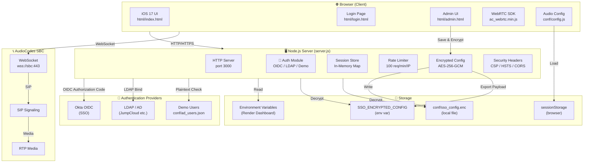
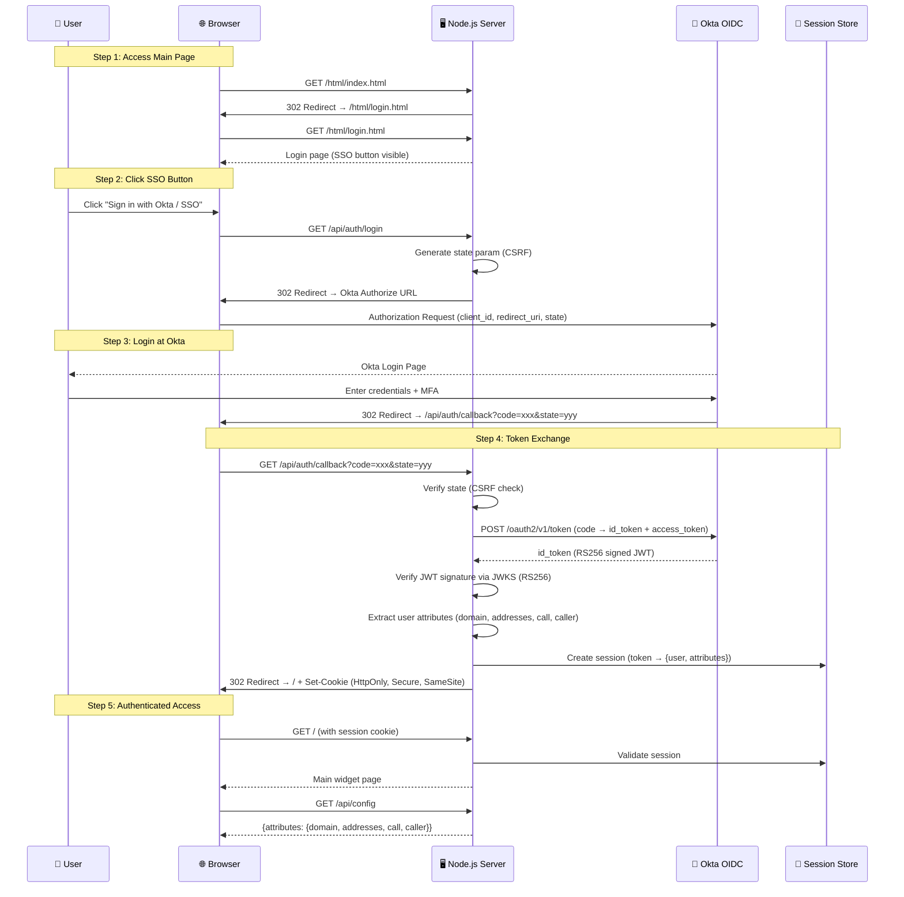
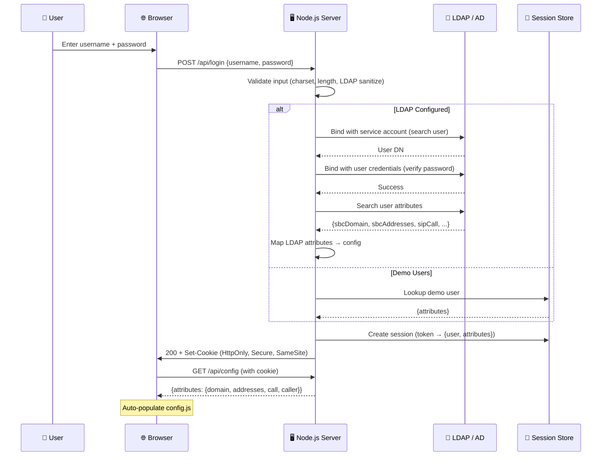
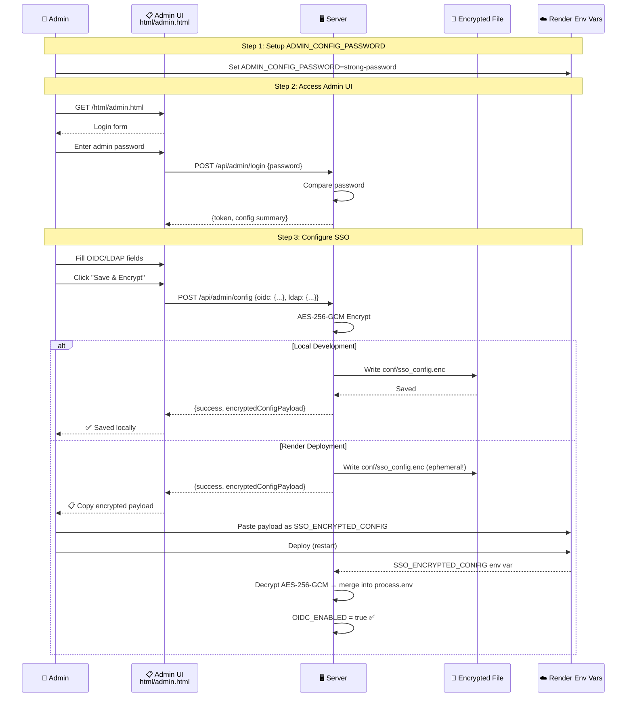
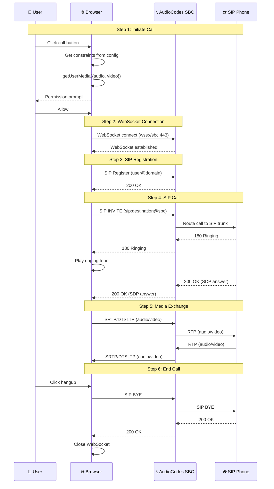
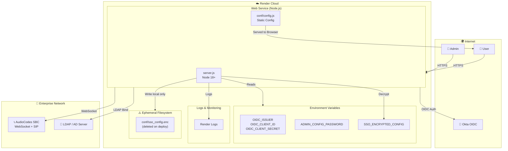
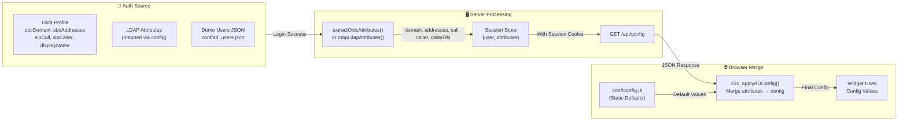
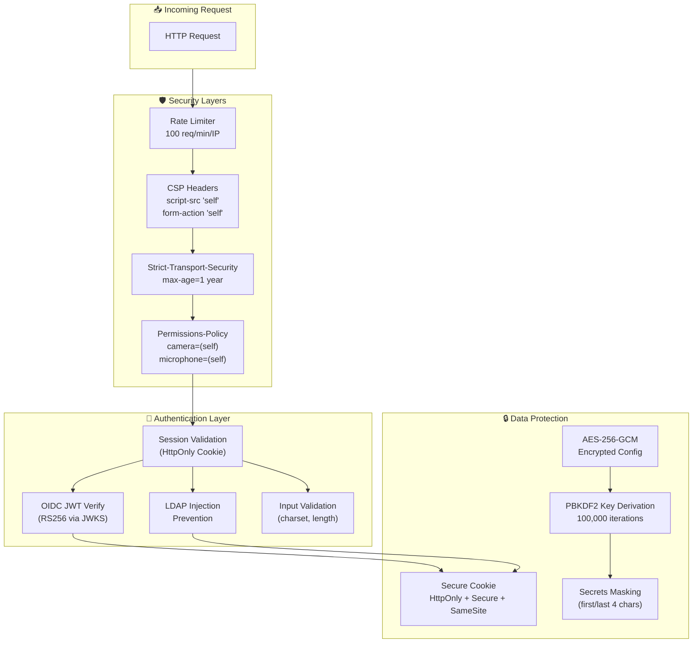

# 🏗️ Architecture Diagrams

## 1. System Architecture Overview

## 2. Authentication Flow (OIDC / Okta SSO)

## 3. Authentication Flow (LDAP / AD)

## 4. Encrypted Config Manager Flow

## 5. WebRTC Call Flow

## 6. Deployment Architecture on Render

## 7. Data Flow: Config Attributes from Auth to Widget

## 8. Security Architecture

---

## 📁 Diagram Files

| File | Description |
|------|-------------|
| `docs/ARCHITECTURE.md` | Full architecture documentation (this file) |

> 💡 These diagrams use [Mermaid](https://mermaid.js.org/) syntax — GitHub renders them automatically in Markdown files.