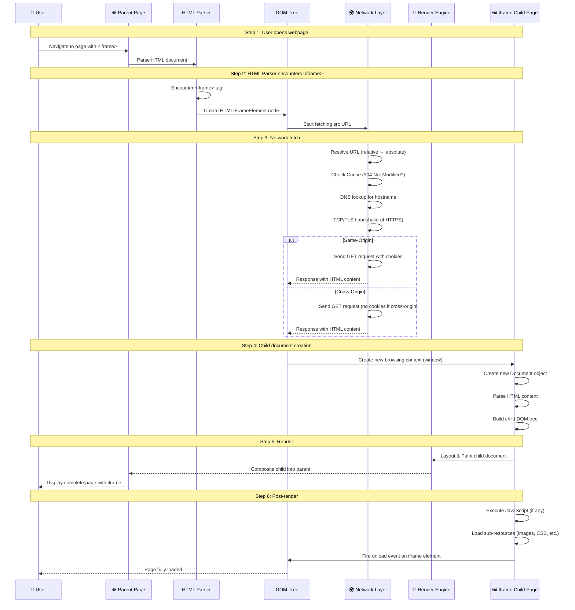
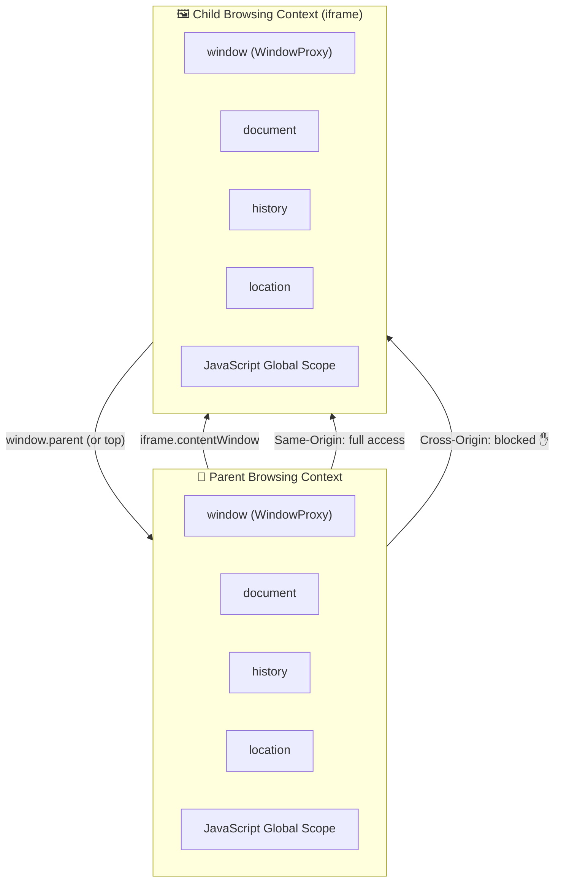
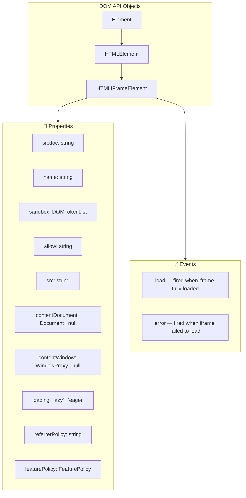
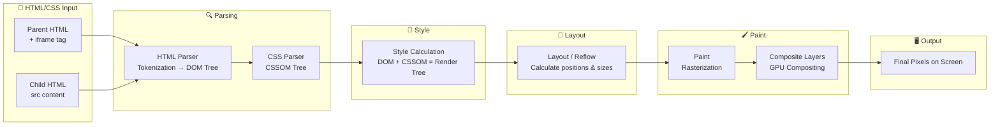
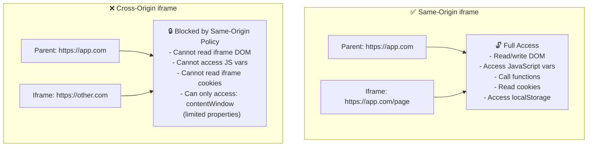
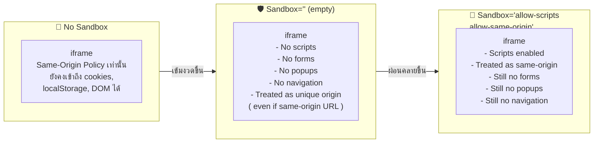
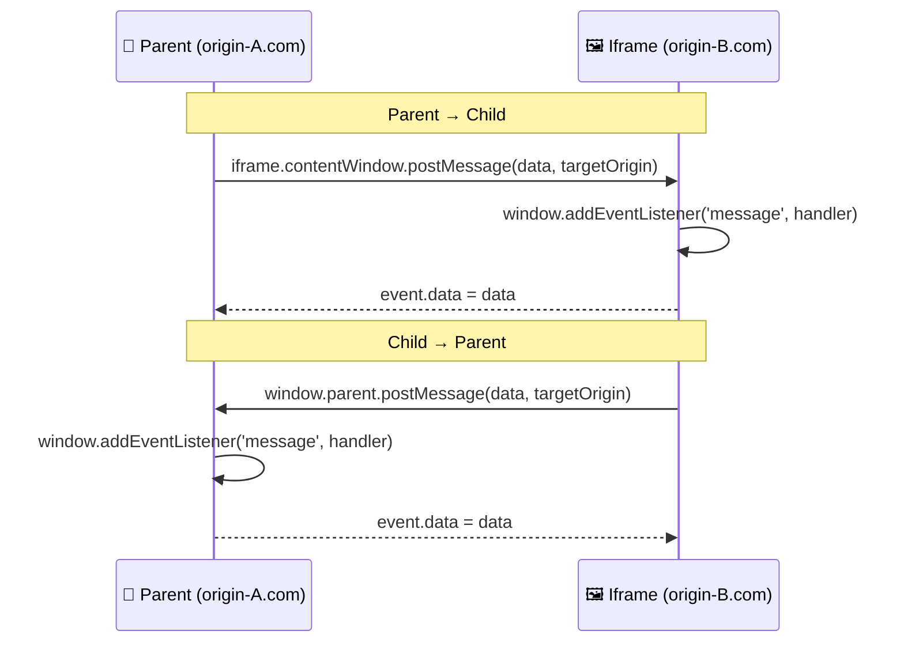
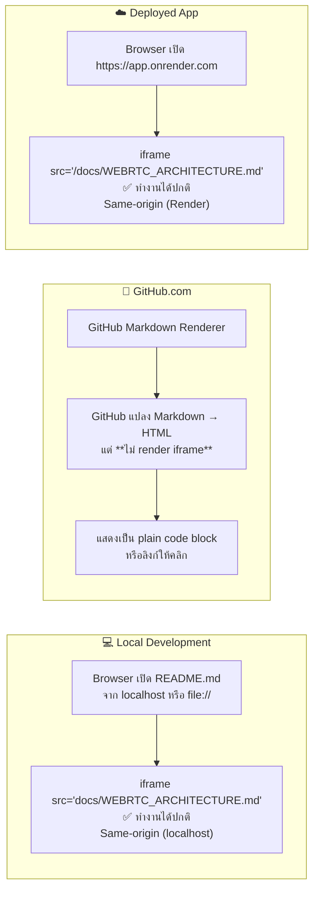
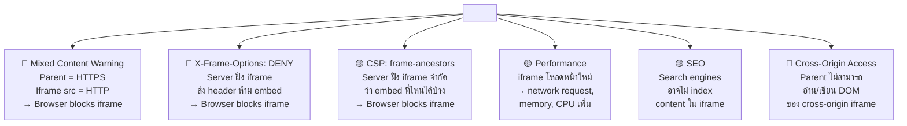
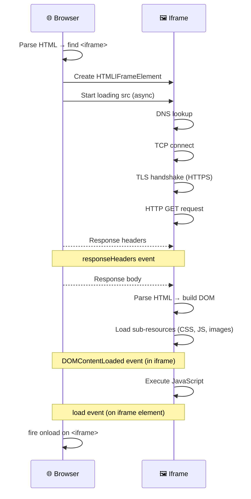

# 🖼️ Iframe Architecture — การทำงานของ iframe ใน Browser อย่างละเอียด

> **อธิบาย:** กลไกการทำงานของ `<iframe>` ในเว็บเบราว์เซอร์  
> **เกี่ยวข้องกับ:** README.md ใช้ iframe แสดง docs/WEBRTC_ARCHITECTURE.md  
> **อัปเดตล่าสุด:** 2026-07-20

---

## สารบัญ

1. [Iframe คืออะไร](#1-iframe-คืออะไร)
2. [กลไกการทำงานของ Iframe ใน Browser](#2-กลไกการทำงานของ-iframe-ใน-browser)
3. [DOM และ Render Pipeline](#3-dom-และ-render-pipeline)
4. [Security Model: Same-Origin vs Cross-Origin](#4-security-model-same-origin-vs-cross-origin)
5. [Sandbox Attribute](#5-sandbox-attribute)
6. [การสื่อสารระหว่าง Parent และ Iframe (postMessage)](#6-การสื่อสารระหว่าง-parent-และ-iframe-postmessage)
7. [Iframe ใน README.md ของโปรเจกต์นี้](#7-iframe-ใน-readmemd-ของโปรเจกต์นี้)
8. [ข้อจำกัดและปัญหาที่พบบ่อย](#8-ข้อจำกัดและปัญหาที่พบบ่อย)
9. [Best Practices](#9-best-practices)

---

## 1. Iframe คืออะไร

**`<iframe>`** (Inline Frame) คือ HTML element ที่ใช้ฝังเอกสาร HTML อีกชิ้นหนึ่งไว้ภายในหน้าเว็บปัจจุบัน เสมือนเป็น "หน้าต่าง" หรือ "browser within a browser"

```html
<!-- โครงสร้างพื้นฐานของ iframe -->
<iframe 
  src="docs/WEBRTC_ARCHITECTURE.md" 
  width="100%" 
  height="600px"
  title="WebRTC Architecture Document">
</iframe>
```

### 1.1 คุณสมบัติหลัก

| คุณสมบัติ | คำอธิบาย |
|-----------|----------|
| **src** | URL ของเอกสารที่จะโหลดเข้ามาใน iframe |
| **width/height** | ขนาดของ iframe (px หรือ %) |
| **title** | คำอธิบายสำหรับ accessibility (screen readers) |
| **sandbox** | กำหนด restrictions ด้านความปลอดภัย |
| **allow** | Permissions Policy เช่น microphone, camera |
| **loading** | `lazy` หรือ `eager` — ควบคุมการโหลด |
| **referrerpolicy** | ควบคุม Referer header |
| **name** | ชื่อสำหรับ target ของ links และ forms |
| **srcdoc** | ใส่ HTML content โดยตรงแทน src |

### 1.2 Iframe สร้างอะไรขึ้นมาบ้าง?

เมื่อเบราว์เซอร์พบ `<iframe>` มันจะสร้าง:

```
┌─────────────────────────────────────┐
│         Parent Document             │
│  ┌───────────────────────────────┐  │
│  │      Iframe Element           │  │
│  │  ┌─────────────────────────┐  │  │
│  │  │   Child Document        │  │  │
│  │  │   (Separate Window)     │  │  │
│  │  │                        │  │  │
│  │  │  - Own DOM Tree        │  │  │
│  │  │  - Own Window Object   │  │  │
│  │  │  - Own Document Object │  │  │
│  │  │  - Own JavaScript      │  │  │
│  │  │    Context (Global)    │  │  │
│  │  │  - Own Session History │  │  │
│  │  │  - Own Browsing        │  │  │
│  │  │    Context             │  │  │
│  │  └─────────────────────────┘  │  │
│  └───────────────────────────────┘  │
└─────────────────────────────────────┘
```

---

## 2. กลไกการทำงานของ Iframe ใน Browser

### 2.1 ขั้นตอนการทำงาน (Step-by-Step)



### 2.2 Browsing Context — หัวใจของ iframe

เมื่อเบราว์เซอร์สร้าง iframe มันจะสร้าง **Browsing Context** ใหม่ ซึ่งแยกจาก parent โดยสิ้นเชิง:



**สิ่งที่ Browsing Context ใหม่ได้มา:**

| Component | คำอธิบาย |
|-----------|----------|
| `window` | Global object ของ child — เรียกจาก parent ได้ว่า `iframe.contentWindow` |
| `document` | DOM tree ของ child — แยกจาก parent โดยสิ้นเชิง |
| `history` | Session history ของ child — ปุ่ม back/forward มีผลแค่ใน iframe |
| `location` | URL ของ child — parent ไม่สามารถเปลี่ยน location ของ cross-origin iframe ได้ |
| `origin` | Origin ของ child — กำหนดโดย protocol + hostname + port |
| `localStorage` | localStorage ของ child — แยกจาก parent ตาม origin |
| `sessionStorage` | sessionStorage ของ child — แยกจาก parent ตาม origin |
| `cookies` | Cookies ของ child — ส่งเฉพาะ cookie ที่ match origin ของ iframe |

---

## 3. DOM และ Render Pipeline

### 3.1 HTMLIFrameElement — DOM Node เบื้องหลัง

ใน DOM tree, `<iframe>` จะถูกแทนด้วย `HTMLIFrameElement` interface ซึ่งมีคุณสมบัติพิเศษ:



### 3.2 Render Pipeline — ตั้งแต่ HTML ถึง Pixel



**รายละเอียดแต่ละขั้นตอนสำหรับ iframe:**

| ขั้นตอน | รายละเอียด |
|---------|-----------|
| **1. HTML Parsing** | Parser เจอ `<iframe>` → สร้าง `HTMLIFrameElement` → เริ่ม fetch `src` แบบ asynchronous (ไม่บล็อก parser หลัก) |
| **2. Subresource Loading** | ขณะที่ parser ทำงานต่อ, network thread จะ fetch URL ของ iframe แบบขนาน |
| **3. Document Creation** | เมื่อ response มาถึง, browser จะสร้าง child browsing context + child document |
| **4. Style Calculation** | CSS ของ child document ถูกคำนวณแยกจาก parent — ไม่มีการรั่วไหลของ CSS ระหว่างกัน |
| **5. Layout** | Layout ของ iframe ถูกคำนวณเป็นส่วนหนึ่งของ parent layout — iframe ทำตัวเหมือน inline-block element |
| **6. Compositing** | GPU สร้าง layer แยกสำหรับ iframe (โดยเฉพาะถ้ามี `will-change` หรือ composited content ข้างใน) |
| **7. Final Output** | Child composited layer ถูก composite ทับลงบน parent ตาม z-index |

### 3.3 JavaScript Execution Context

```javascript
// Parent document (main.js)
const iframe = document.getElementById('myIframe');

// ✅ Same-Origin: สามารถเข้าถึงทุกอย่างได้
if (iframe.contentDocument) {
    const heading = iframe.contentDocument.querySelector('h1');
    console.log(heading.textContent);
}

// ✅ Same-Origin: เรียก function ใน iframe ได้
iframe.contentWindow.someFunction();

// ✅ Same-Origin: แก้ไข DOM ใน iframe ได้
iframe.contentDocument.body.style.background = 'blue';

// ❌ Cross-Origin: จะเกิด SecurityError
try {
    console.log(iframe.contentDocument.body);
} catch (e) {
    // DOMException: Blocked a frame with origin "https://parent.com"
    // from accessing a cross-origin frame.
}
```

---

## 4. Security Model: Same-Origin vs Cross-Origin

### 4.1 Origin คืออะไร?

**Origin** ประกอบด้วย 3 ส่วน:

```
https://example.com:443
│      │               │
└──┬───┘    └──┬───────┘ └┬┘
  Protocol    Hostname    Port
```

| URL | Origin | เปรียบเทียบ |
|-----|--------|-------------|
| `https://example.com` | `https://example.com` | — |
| `https://example.com/page` | `https://example.com` | ✅ Same-origin |
| `https://example.com:3000` | `https://example.com:3000` | ❌ ต่าง port |
| `http://example.com` | `http://example.com` | ❌ ต่าง protocol |
| `https://sub.example.com` | `https://sub.example.com` | ❌ ต่าง hostname |

### 4.2 Same-Origin Policy (SOP) สำหรับ iframe



### 4.3 Cross-Origin: สิ่งที่เข้าถึงได้และไม่ได้

```javascript
const iframe = document.getElementById('crossOriginIframe');
const win = iframe.contentWindow;

// ✅ สิ่งที่เข้าถึงได้เสมอ (limited properties):
console.log(win.closed);        // boolean
console.log(win.frames);        // WindowProxy array
console.log(win.length);        // number of child frames
console.log(win.location);      // 🔶 อ่านได้แต่อ่านได้แค่ URL (บาง browser)
win.location = 'https://...';   // 🔶 เปลี่ยน location ได้ (แต่ต้อง navigate)
console.log(win.self);          // WindowProxy
console.log(win.parent);        // WindowProxy
console.log(win.top);           // WindowProxy
console.log(win.window);        // WindowProxy

// ❌ สิ่งที่เข้าถึงไม่ได้:
win.document;                   // ❌ SecurityError
win.localStorage;               // ❌ SecurityError
win.sessionStorage;             // ❌ SecurityError
win.name;                       // ❌ SecurityError (บาง browser)
win.someVariable;               // ❌ undefined
win.someFunction();             // ❌ TypeError
```

### 4.4 Cross-Origin Read Blocking (CORB)

เมื่อ Chrome เห็นว่า cross-origin response กำลังถูกโหลดใน iframe และ response type ไม่ตรงกับที่คาดไว้ (เช่น HTML ถูก serve เป็น `application/json`), Chrome จะบล็อก response นั้นด้วย **CORB** เพื่อป้องกันการรั่วไหลของข้อมูลผ่าน side-channel attacks

---

## 5. Sandbox Attribute

### 5.1 Sandbox คืออะไร?

`sandbox` attribute เป็น security mechanism ที่ impose restrictions บน content ใน iframe:

```html
<!-- Sandbox ที่เข้มงวดที่สุด — ไม่มี permission ใดเลย -->
<iframe src="page.html" sandbox></iframe>

<!-- Sandbox แบบมีสิทธิ์บางอย่าง -->
<iframe src="page.html" sandbox="allow-scripts allow-same-origin"></iframe>
```

### 5.2 Sandbox Options

| Token | ความหมาย | เปิดใช้งาน |
|-------|----------|-----------|
| *(ไม่มีค่า)* | Block ทุกอย่าง | — |
| `allow-scripts` | อนุญาตให้รัน JavaScript | ✅ |
| `allow-same-origin` | ถือว่าเป็น same-origin | ✅ |
| `allow-forms` | อนุญาตให้ submit forms | ✅ |
| `allow-popups` | อนุญาตให้เปิด popup windows | ✅ |
| `allow-popups-to-escape-sandbox` | Popup ที่เปิดจะไม่มี sandbox | ✅ |
| `allow-top-navigation` | อนุญาตให้ iframe เปลี่ยน location ของ parent | ✅ |
| `allow-top-navigation-by-user-activation` | เหมือนข้างบน แต่ต้องมี user gesture | ✅ |
| `allow-modals` | อนุญาตให้ใช้ alert(), confirm(), prompt() | ✅ |
| `allow-presentation` | อนุญาตให้ใช้ Presentation API | ✅ |
| `allow-orientation-lock` | อนุญาตให้ล็อคหน้า | ✅ |
| `allow-pointer-lock` | อนุญาตให้ใช้ Pointer Lock API | ✅ |
| `allow-downloads` | อนุญาตให้ดาวน์โหลดไฟล์ | ✅ |
| `allow-storage-access-by-user-activation` | อนุญาตให้เข้าถึง storage ที่ถูก block | ✅ |

### 5.3 Sandbox = Same-Origin Policy ที่เข้มขึ้น



---

## 6. การสื่อสารระหว่าง Parent และ Iframe (postMessage)

### 6.1 ปัญหาที่ต้องแก้

เนื่องจาก Same-Origin Policy ขัดขวางการสื่อสารระหว่าง cross-origin iframe กับ parent, `window.postMessage()` เป็นวิธีเดียวที่ปลอดภัยในการสื่อสารข้าม origin

### 6.2 postMessage API



### 6.3 ตัวอย่างการใช้งาน

```javascript
// === Parent Code ===
// ส่งข้อความไปยัง iframe (เฉพาะ origin-B.com)
const iframe = document.getElementById('myIframe');
iframe.contentWindow.postMessage(
    { type: 'SET_CONFIG', call: '1000', caller: 'admin' },
    'https://origin-b.com'
);

// รับข้อความจาก iframe
window.addEventListener('message', (event) => {
    // IMPORTANT: ตรวจสอบ origin ทุกครั้ง!
    if (event.origin !== 'https://origin-b.com') return;
    
    console.log('Received from iframe:', event.data);
    // event.data = { type: 'CALL_ESTABLISHED', duration: 30 }
});

// === Iframe Code ===
// ส่งข้อความไปยัง parent (เฉพาะ origin-A.com)
window.parent.postMessage(
    { type: 'CALL_ESTABLISHED', duration: 30 },
    'https://origin-a.com'
);

// รับข้อความจาก parent
window.addEventListener('message', (event) => {
    if (event.origin !== 'https://origin-a.com') return;
    
    if (event.data.type === 'SET_CONFIG') {
        applyConfig(event.data);
    }
});
```

### 6.4 Security Checklist สำหรับ postMessage

| ข้อ | คำอธิบาย |
|-----|----------|
| ✅ | **ตรวจสอบ `event.origin`** ทุกครั้ง — อย่าไว้ใจใคร |
| ✅ | **ตรวจสอบ `event.data` structure** — validate type, fields |
| ✅ | **ใช้ `targetOrigin`** อย่าใช้ `*` (asterisk) ถ้าไม่จำเป็น |
| ✅ | **ใช้ `allow-scripts allow-same-origin`** ด้วยความระวัง |
| ❌ | **อย่าใช้ `eval()`** กับ data ที่ได้รับจาก postMessage |
| ❌ | **อย่าใช้ `innerHTML`** กับ data ที่ได้รับจาก postMessage |

---

## 7. Iframe ใน README.md ของโปรเจกต์นี้

### 7.1 การใช้งานจริง

```html
<!-- ใน README.md -->
<iframe 
  src="docs/WEBRTC_ARCHITECTURE.md" 
  width="100%" 
  height="600px" 
  style="border: 1px solid #ccc; border-radius: 8px; margin-top: 12px;" 
  title="WebRTC Architecture Document">
</iframe>
```

### 7.2 การทำงานบน GitHub กับบน Browser



### 7.3 ทำไม GitHub ถึงไม่แสดง iframe?

GitHub ใช้ **Markdown Renderer** ของตัวเอง (CommonMark + extensions) ซึ่ง:

| เหตุผล | รายละเอียด |
|--------|-----------|
| **Security Policy** | GitHub ไม่อนุญาตให้ embed HTML elements ที่เป็นอันตราย เช่น `<iframe>`, `<script>`, `<form>` |
| **Markdown Spec** | Markdown มาตรฐานอนุญาต HTML inline — แต่ GitHub กรอง HTML tags ที่อันตราย |
| **XSS Prevention** | ถ้า GitHub อนุญาต iframe, ผู้ใช้สามารถ embed เว็บอันตรายใน README ได้ |
| **Sanitization** | GitHub ใช้ `sanitize-html` หรือ `DOMPurify` เพื่อลบ tags ที่ไม่ปลอดภัย |

**ผลลัพธ์:** บน GitHub, iframe จะถูก sanitized ออกไป และแสดงเป็น plain text หรือไม่แสดงเลย

### 7.4 แล้ว iframe ใน README มีประโยชน์เมื่อไหร่?

| สถานการณ์ | iframe ทำงาน? |
|------------|--------------|
| บน GitHub.com | ❌ ไม่แสดง |
| เปิด README.md ใน VS Code Preview | ✅ แสดง |
| เปิดผ่าน local dev server (localhost:3000) | ✅ แสดง |
| เปิดผ่าน Render / production deploy | ✅ แสดง |
| VS Code Extension ที่ใช้ Markdown Preview | ⚠️ แล้วแต่ extension |

---

## 8. ข้อจำกัดและปัญหาที่พบบ่อย

### 8.1 ปัญหาที่พบบ่อย



### 8.2 Mixed Content Warning

```html
<!-- ❌ ไม่ทำงาน: Parent HTTPS, Iframe HTTP -->
<iframe src="http://insecure.com"></iframe>
<!-- Browser จะบล็อกด้วย: Mixed Content: The page was loaded over HTTPS,
     but attempted to load an insecure resource -->

<!-- ✅ ถูกต้อง: ใช้ HTTPS ทั้งคู่ -->
<iframe src="https://secure.com"></iframe>
```

### 8.3 X-Frame-Options

Server สามารถส่ง HTTP header เพื่อป้องกันไม่ให้หน้าเว็บถูก embed ใน iframe:

```
# DENY — ไม่ให้ embed ที่ไหนเลย
X-Frame-Options: DENY

# SAMEORIGIN — ให้ embed เฉพาะ same-origin
X-Frame-Options: SAMEORIGIN

# ALLOW-FROM (deprecated) — ให้ embed เฉพาะ URL ที่กำหนด
X-Frame-Options: ALLOW-FROM https://example.com
```

### 8.4 Content Security Policy: frame-ancestors

CSP version ของ X-Frame-Options ที่มีประสิทธิภาพกว่า:

```
# ไม่ให้ embed ที่ไหนเลย
Content-Security-Policy: frame-ancestors 'none';

# ให้ embed เฉพาะ same-origin
Content-Security-Policy: frame-ancestors 'self';

# ให้ embed เฉพาะ domain ที่กำหนด
Content-Security-Policy: frame-ancestors https://app.com https://admin.com;

# ให้ embed ได้ทุกที่ (⚠ ไม่ปลอดภัย)
Content-Security-Policy: frame-ancestors *;
```

### 8.5 Performance Impact

| Metric | ผลกระทบ |
|--------|---------|
| **Network Requests** | iframe แต่ละอัน = HTTP request 1 ครั้ง (หรือมากกว่าถ้ามี subresources) |
| **Memory** | DOM tree, JavaScript heap, render layers เพิ่มขึ้น |
| **CPU** | Parsing, style calculation, layout, paint สำหรับ child document |
| **Main Thread** | JavaScript execution ใน iframe ใช้ main thread ร่วมกับ parent |
| **LCP (Largest Contentful Paint)** | อาจช้าลงเพราะ browser ต้องรอ iframe โหลด |
| **Cumulative Layout Shift** | ถ้า iframe ไม่ได้กำหนด width/height ไว้ อาจเกิด layout shift |

**วิธีลดผลกระทบ:**

```html
<!-- 1. ใช้ loading="lazy" เพื่อเลื่อนการโหลด iframe ที่ไม่จำเป็น -->
<iframe src="heavy.html" loading="lazy"></iframe>

<!-- 2. กำหนด width/height ที่แน่นอน เพื่อป้องกัน layout shift -->
<iframe src="page.html" width="100%" height="600" style="aspect-ratio: 16/9;"></iframe>

<!-- 3. ใช้ fetchpriority="low" สำหรับ iframe ที่ไม่สำคัญ -->
<iframe src="page.html" fetchpriority="low"></iframe>
```

---

## 9. Best Practices

### 9.1 เมื่อไหร่ควรใช้ iframe

| ควรใช้ ✅ | ไม่ควรใช้ ❌ |
|-----------|-------------|
| Embed content จาก third-party (YouTube, Maps, etc.) | แทนการใช้ server-side include |
| แสดง documentation หรือ help content | แทนการใช้ SPA routing |
| แยก sandboxed application (payment forms) | เพื่อหลีกเลี่ยง CORS |
| Legacy application integration | เพื่อ bypass security policies |
| Preview content (WYSIWYG editors) | เมื่อมี native HTML/CSS solution |

### 9.2 Security Checklist

```html
<!-- ✅ ดี: Minimal sandbox, specific allow, specific height -->
<iframe 
  src="widget.html"
  width="100%"
  height="500"
  title="Widget"
  sandbox="allow-scripts allow-same-origin"
  allow="camera 'none'; microphone 'none'"
  loading="lazy"
  referrerpolicy="no-referrer">
</iframe>

<!-- ❌ ไม่ดี: No sandbox, no title, no size -->
<iframe src="widget.html"></iframe>
```

### 9.3 Accessibility

```html
<!-- ✅ ดี: มี title สำหรับ screen readers -->
<iframe src="chart.html" title="Sales Chart Q2 2026"></iframe>

<!-- ❌ ไม่ดี: ไม่มี title -->
<iframe src="chart.html"></iframe>

<!-- ❌ ไม่ดี: title ไม่สื่อความหมาย -->
<iframe src="chart.html" title="iframe"></iframe>
```

### 9.4 Responsive Iframe

```css
/* ทำให้ iframe responsive */
.iframe-container {
    position: relative;
    width: 100%;
    padding-bottom: 56.25%; /* 16:9 aspect ratio */
    height: 0;
    overflow: hidden;
}

.iframe-container iframe {
    position: absolute;
    top: 0;
    left: 0;
    width: 100%;
    height: 100%;
    border: 0;
}
```

```html
<div class="iframe-container">
    <iframe src="page.html" title="Responsive iframe"></iframe>
</div>
```

### 9.5 Fallback Content

```html
<!-- เบราว์เซอร์ที่ไม่รองรับ iframe จะแสดง fallback content -->
<iframe src="modern.html" title="Content">
    <!-- Fallback: แสดงเฉพาะเมื่อ browser ไม่รองรับ iframe -->
    <p>Your browser does not support iframes. 
       <a href="modern.html">View content directly</a>.</p>
</iframe>
```

---

## Appendix A: Iframe Events Timeline



## Appendix B: Browser Support

| Browser | iframe support | sandbox | srcdoc | loading=lazy |
|---------|---------------|---------|--------|--------------|
| Chrome | ✅ | ✅ | ✅ | ✅ |
| Firefox | ✅ | ✅ | ✅ | ✅ |
| Safari | ✅ | ✅ | ✅ | ✅ |
| Edge | ✅ | ✅ | ✅ | ✅ |
| iOS Safari | ✅ | ✅ | ✅ | ✅ |
| Android Chrome | ✅ | ✅ | ✅ | ✅ |

## Appendix C: คำศัพท์น่ารู้

| คำศัพท์ | คำอธิบาย |
|---------|----------|
| **Browsing Context** | สภาพแวดล้อมที่ document ทำงานอยู่ — มี window, document, history, origin เป็นของตัวเอง |
| **Origin** | Protocol + Hostname + Port — ใช้ระบุที่มาของ resource |
| **Same-Origin Policy** | นโยบายความปลอดภัยที่ห้าม document หนึ่ง access อีก document หนึ่งถ้าต่าง origin |
| **Cross-Origin** | การเข้าถึง resource ที่มี origin ต่างกัน |
| **Sandbox** | กลไกความปลอดภัยที่ restrict ความสามารถของ iframe |
| **CORB** | Cross-Origin Read Blocking — Chrome ป้องกันการอ่าน cross-origin data |
| **X-Frame-Options** | HTTP header ที่ควบคุมว่า page ถูก embed ใน iframe ได้หรือไม่ |
| **CSP frame-ancestors** | Content Security Policy directive ที่ควบคุม iframe embedding |
| **postMessage** | API สำหรับส่งข้อความข้าม origin ระหว่าง window ต่างๆ |
| **WindowProxy** | Object ที่ใช้แทน Window object สำหรับ cross-origin access — มี limited properties |
| **Compositing** | กระบวนการรวม layers ต่างๆ เข้าด้วยกันเป็นภาพสุดท้ายบนหน้าจอ |
| **Mixed Content** | สถานการณ์ที่หน้า HTTPS พยายามโหลด resource HTTP — browser จะบล็อก |