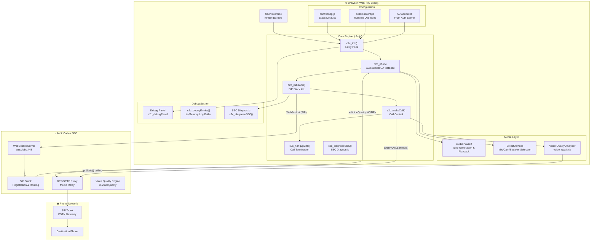
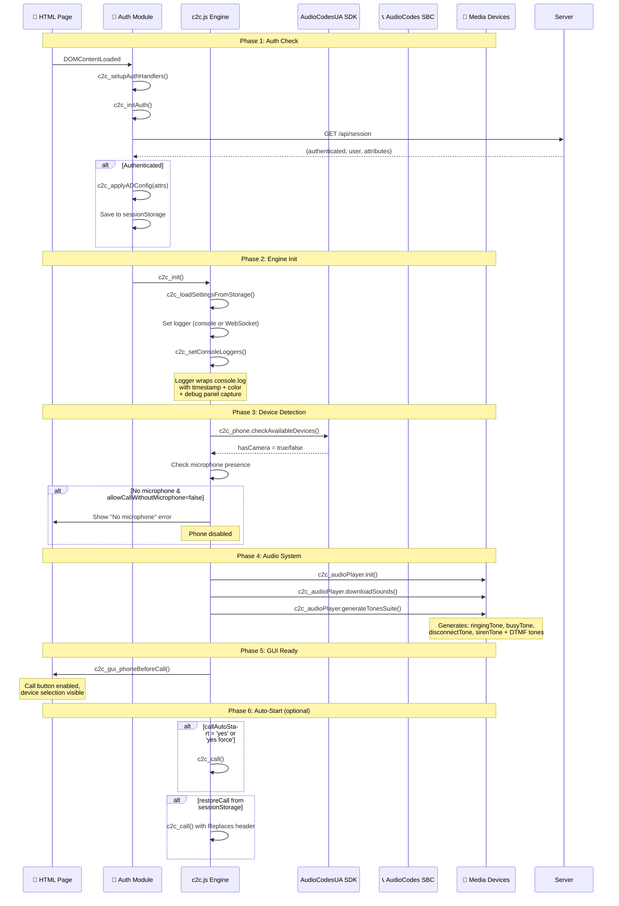
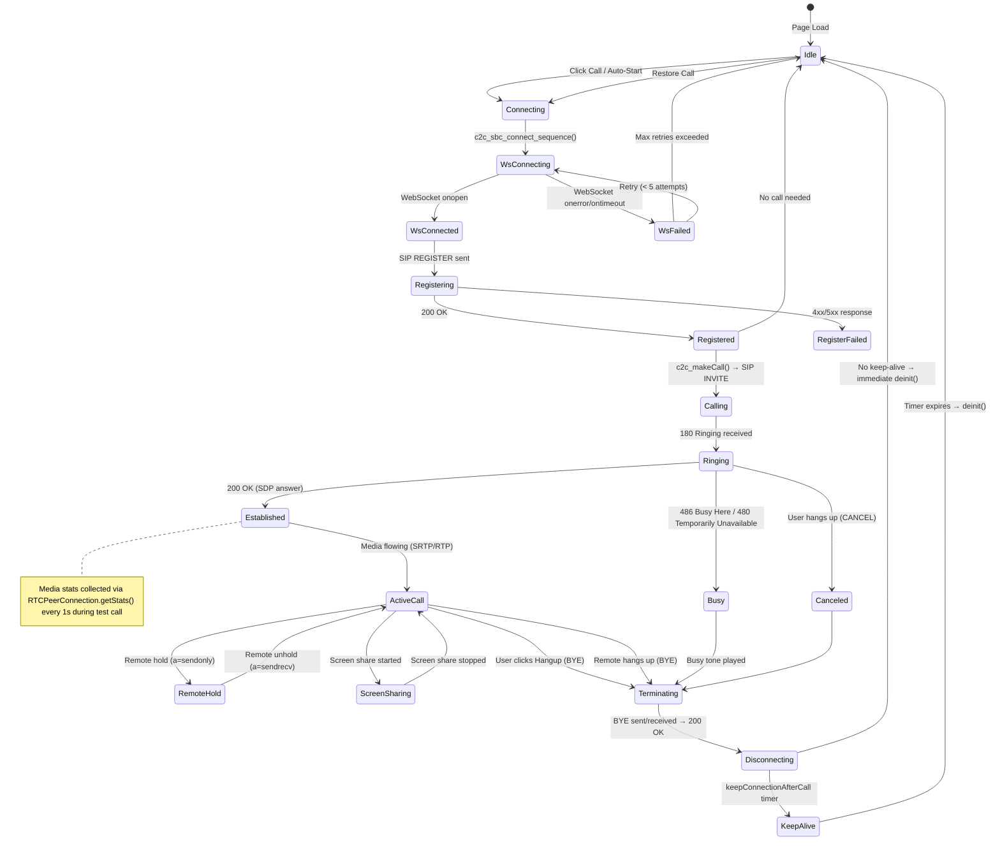
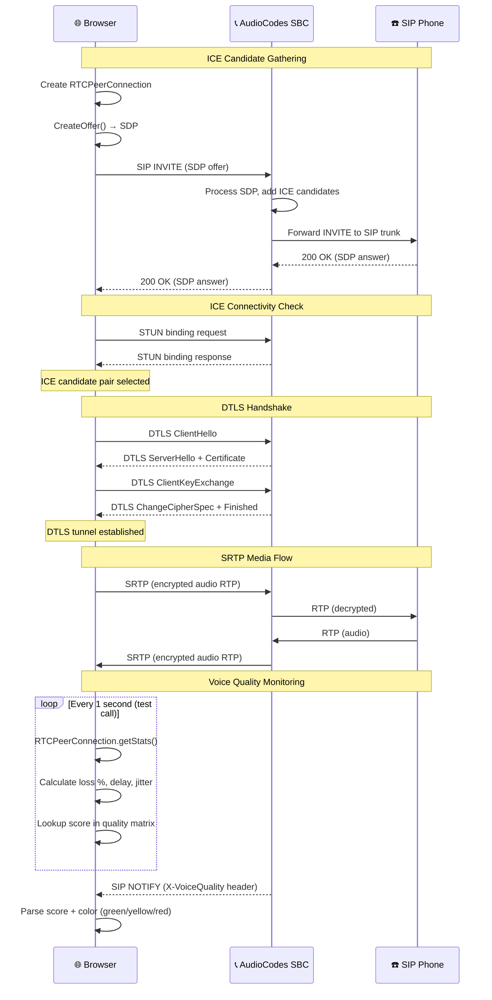
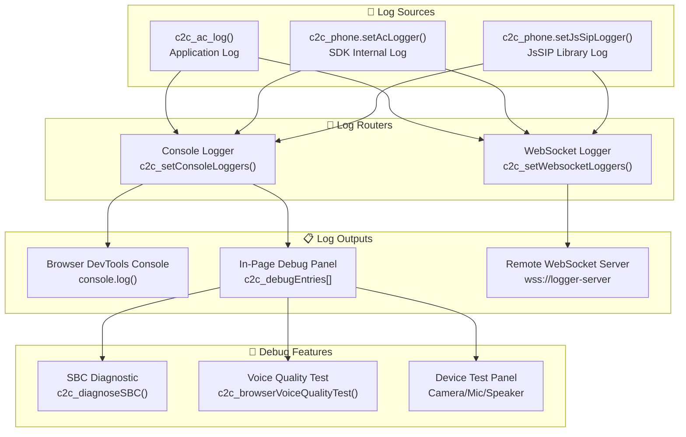
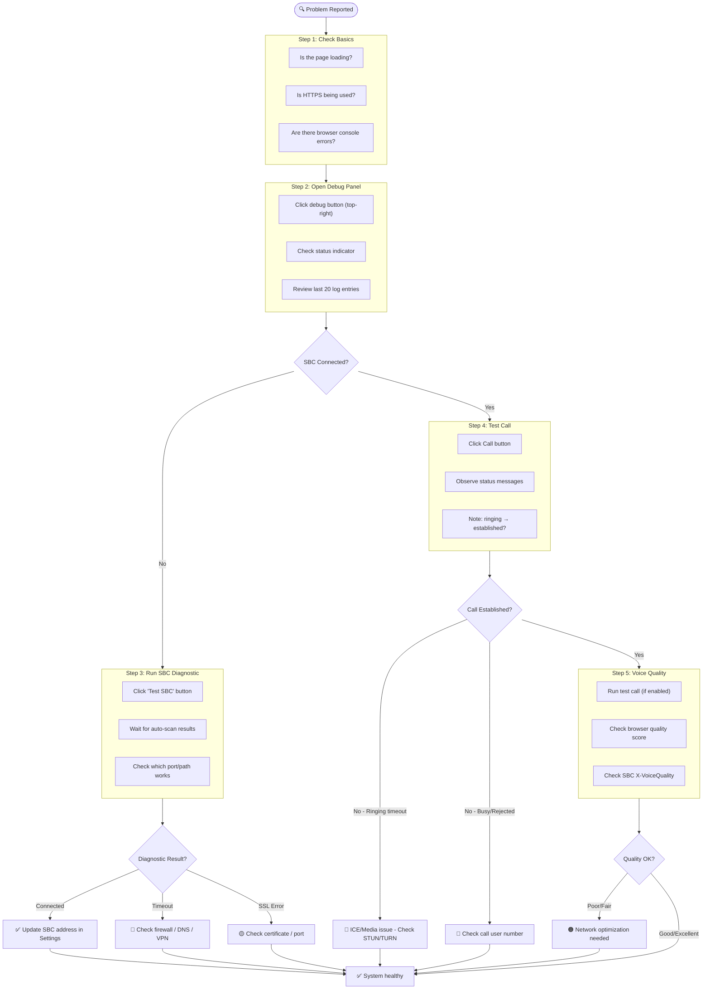
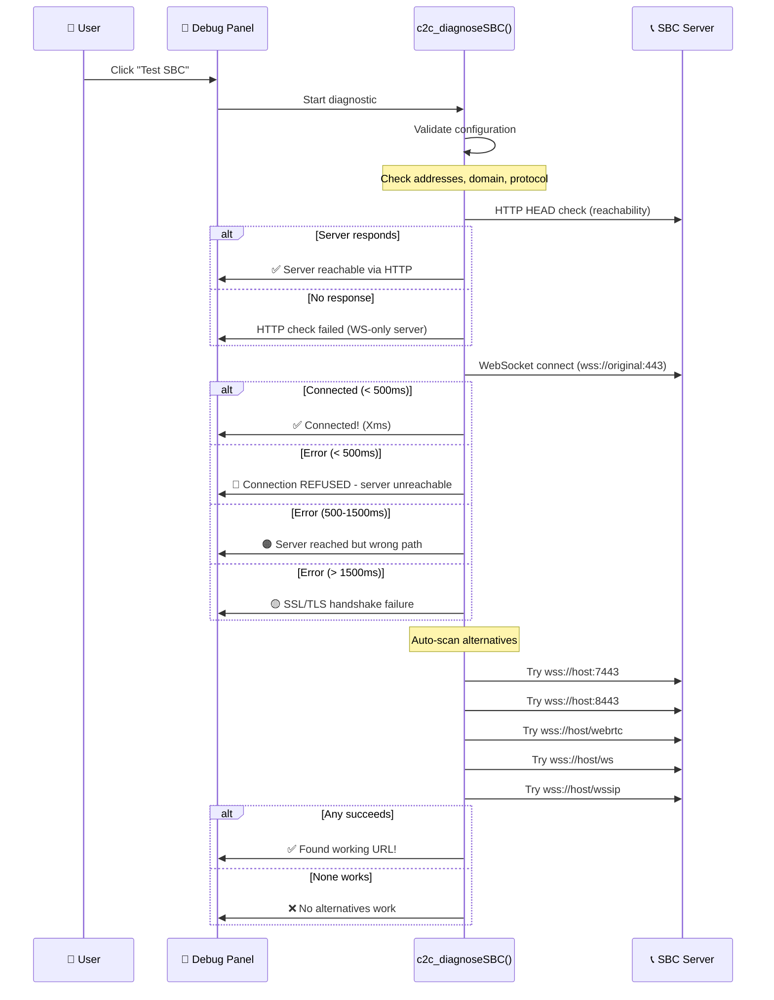
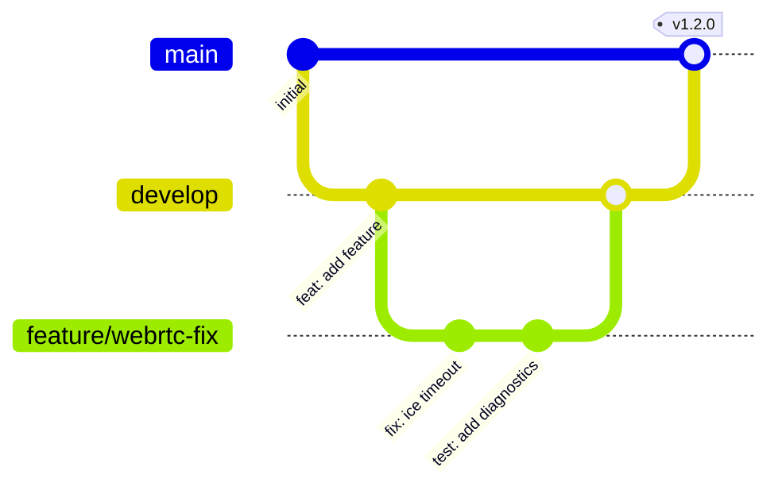

# 📞 WebRTC Architecture, Log Analysis & Troubleshooting Guide

> **Project:** Voice Team Click-to-Call Widget  
> **SDK:** AudioCodes UA SDK 1.21.0  
> **Last Updated:** 2026-07-20

---

## Table of Contents

1. [WebRTC Internal Architecture](#1-webrtc-internal-architecture)
2. [Detailed Call Flow with State Machine](#2-detailed-call-flow-with-state-machine)
3. [Logging System Architecture](#3-logging-system-architecture)
4. [Log Analysis Guide](#4-log-analysis-guide)
5. [Troubleshooting Workflow](#5-troubleshooting-workflow)
6. [Common Issues & Resolutions](#6-common-issues--resolutions)
7. [Git Workflow for Changes](#7-git-workflow-for-changes)

---

## 1. WebRTC Internal Architecture

### 1.1 High-Level Component Diagram



### 1.2 WebRTC SDK Initialization Sequence



### 1.3 SIP Call State Machine



### 1.4 Media Flow (SRTP/DTLS)



---

## 2. Detailed Call Flow with State Machine

### 2.1 Call Initiation (`c2c_call()`)

```javascript
// Call flow:
c2c_call()
  ├── Check c2c_create_x_header() (optional custom SIP header)
  ├── Clear SBC disconnect timer
  ├── Set c2c_isStartCall = true
  ├── Stop audio player
  ├── Update GUI → "Calling..." state
  ├── if (!c2c_phone.isInitialized())
  │     └── c2c_sbc_connect_sequence()
  │           └── c2c_initStack({user, displayName, password: ''})
  │                 ├── c2c_phone.setServerConfig(addresses, domain, iceServers)
  │                 ├── c2c_phone.setAccount(user, displayName, password)
  │                 ├── c2c_phone.setWebSocketKeepAlive(...)
  │                 ├── c2c_phone.setListeners({...})  ← Register all callbacks
  │                 ├── c2c_phone.setEnableAddVideo(type !== 'audio')
  │                 ├── c2c_phone.setNetworkPriority(...)
  │                 ├── c2c_phone.setModes(modes)
  │                 └── c2c_phone.init(false)
  │                       └── WebSocket connect → SIP REGISTER
  │                             └── On 'connected' → c2c_startCall()
  └── else if (c2c_isWsConnected)
        └── c2c_startCall()
              └── c2c_makeCall(call, videoOption)
                    ├── Create RTCPeerConnection (with ICE config)
                    ├── Create SDP offer
                    ├── Add extra SIP headers (X-header, X-Token)
                    ├── SIP INVITE sent via WebSocket
                    └── Wait for response...
```

### 2.2 Call Termination (`c2c_hangupCall()`)

```javascript
c2c_hangupCall()
  └── c2c_activeCall.terminate()
        └── SIP BYE sent
              └── On 'callTerminated' callback:
                    ├── c2c_activeCall = null
                    ├── c2c_audioPlayer.stop()
                    ├── Play disconnect/busy tone
                    ├── if (keepConnectionAfterCall > 0)
                    │     └── setTimeout → c2c_phone.deinit()
                    └── else
                          └── c2c_phone.deinit() immediately
```

### 2.3 Page Reload Call Restoration

```javascript
// On beforeunload:
c2c_onBeforeUnload()
  └── if (activeCall && established)
        └── Save to sessionStorage:
              { callTo, video, replaces, time, hold, address, selfVideo }

// On next page load:
c2c_startPhone()
  └── Read sessionStorage('c2c_restoreCall')
        └── if (delay < restoreCallMaxDelay)
              └── c2c_restoreCall = data
                    └── On SBC connected:
                          └── c2c_makeCall() with Replaces header
```

---

## 3. Logging System Architecture

### 3.1 Logger Hierarchy



### 3.2 Log Format

Each log entry follows this format:

```
HH:MM:SS.mmm [%c] Message [optional data]
```

| Component | Description | Example |
|-----------|-------------|---------|
| `HH:MM:SS.mmm` | Timestamp (hours:minutes:seconds.milliseconds) | `14:23:05.123` |
| `%c` | Color styling (Chrome/Firefox/Safari only) | `color: BlueViolet;` |
| `Message` | Log text with prefix | `phone>>> loginStateChanged: connected` |
| `[data]` | Optional JSON data | `{address: "wss://sbc:443"}` |

### 3.3 Log Prefix Categories

| Prefix | Source | Purpose |
|--------|--------|---------|
| `phone>>>` | c2c.js | Application-level events (callbacks, state changes) |
| `c2c:` | c2c.js | UI actions and device operations |
| `devices:` | c2c.js | Device enumeration and selection |
| `[Auth]` | c2c.js | Authentication events |
| `[Config]` | c2c.js | Configuration values at startup |
| `[SBC]` | c2c.js | SBC connection events |
| `[Diag]` | c2c.js | Diagnostic test results |
| `AudioPlayer2` | c2c_utils.js | Audio playback events |
| `SDK:` | ac_webrtc.min.js | AudioCodes UA SDK internal logs |
| `JsSIP:` | JsSIP library | SIP protocol-level logs |

### 3.4 Debug Panel

The in-page debug panel (`c2c_debugPanel`) provides:

- **Real-time log capture:** All `c2c_ac_log()` calls are duplicated to `c2c_debugEntries[]` array
- **500-entry ring buffer:** Oldest entries are dropped when limit is exceeded
- **Three severity levels:** `info` (blue), `warn` (orange), `error` (red)
- **Copy to clipboard:** `c2c_copyDebugLog()` exports all entries as plain text
- **Clear button:** `c2c_clearDebugLog()` resets the buffer
- **Status indicator:** Shows connection state and error/warning count
- **SBC Diagnostic button:** `c2c_diagnoseSBC()` runs connectivity tests

---

## 4. Log Analysis Guide

### 4.1 Normal Startup Log Sequence

A healthy startup produces logs in this order:

```
14:23:05.001 ------ Date: Mon Jul 20 2026 -------
14:23:05.002 Voice Team Click-to-Call
14:23:05.003 SDK: 1.21.0
14:23:05.004 SIP: JsSIP_X.X.X
14:23:05.005 Browser: Chrome  Browser: chrome|windows
14:23:05.006 [Config] SBC addresses: ["wss://sbc.voiceteam.local:443"]
14:23:05.007 [Config] Domain: sbc.voiceteam.local
14:23:05.008 [Config] Call user: 1000
14:23:05.009 [Config] Caller: 1000
14:23:05.010 [Config] Call type: user_control
14:23:05.011 [Config] Protocol: https:
14:23:05.012 [Config] User agent: Mozilla/5.0 ...
14:23:05.020 Camera is present
14:23:05.030 AudioPlayer2: init AudioElement (chrome)
14:23:05.050 AudioPlayer2: downloadSounds ...
14:23:05.200 AudioPlayer2: generateTonesSuite
14:23:05.500 AudioPlayer2: sounds are ready
```

### 4.2 Normal Call Flow Log Sequence

```
[User clicks Call button]
14:23:10.001 phone>> "call button" onclick event
14:23:10.002 [SBC] Connecting to: ["wss://sbc.voiceteam.local:443"]
14:23:10.003 [SBC] Domain: sbc.voiceteam.local
14:23:10.010 phone>>> loginStateChanged: connected
14:23:10.011 [SBC] WebSocket connected to wss://sbc.voiceteam.local:443
14:23:10.015 phone>>> loginStateChanged: login
14:23:10.020 phone>>> outgoing call progress
14:23:10.021 AudioPlayer2 [AudioElement]: play: {"name":"ringingTone","loop":true,"volume":0.2}
14:23:12.500 phone>>> callConfirmed
14:23:12.501 AudioPlayer2 [AudioElement]: stop
14:23:12.510 phone>>> callShowStreams
14:23:12.520 Call is established
```

### 4.3 Error Log Patterns & Diagnosis

#### Pattern A: WebSocket Connection Failure

```
14:23:10.002 [SBC] Connecting to: ["wss://sbc.voiceteam.local:443"]
14:23:10.010 phone>>> loginStateChanged: disconnected
14:23:10.011 [SBC] WebSocket disconnected
14:23:10.012 [SBC] Reconnection attempt 1/5
... (repeats 5 times)
14:23:40.000 [SBC] Too many disconnection attempts (5 max)
14:23:40.001 [SBC] Check server address: ["wss://sbc.voiceteam.local:443"]
14:23:40.002 [SBC] Check domain: sbc.voiceteam.local
```

**Diagnosis:**
- SBC server is unreachable or DNS not resolving
- Firewall blocking outbound port 443
- Wrong WebSocket URL (port, path, or hostname)

**Fix:**
1. Click "Test SBC" button in Debug panel
2. Check if server is pingable
3. Verify WebSocket URL in Settings panel
4. Try alternative ports: 7443, 8443
5. Try alternative paths: /webrtc, /ws, /wssip

#### Pattern B: ICE/Media Failure

```
14:23:10.020 phone>>> outgoing call progress
14:23:10.021 AudioPlayer2: play ringingTone
... (ringing continues, no callConfirmed)
14:23:30.000 phone>>> call terminated callback, cause=ICE_TIMEOUT
```

**Diagnosis:**
- ICE connectivity check failed
- STUN/TURN servers not configured or unreachable
- Network firewall blocking UDP ports for RTP

**Fix:**
1. Configure STUN/TURN servers in `conf/config.js` → `iceServers`
2. Check if UDP ports (typically 10000-20000) are open
3. Enable `iceTransportPolicyRelay: true` to force TURN relay

#### Pattern C: SIP Registration Failure

```
14:23:10.010 phone>>> loginStateChanged: connected
14:23:10.015 phone>>> loginStateChanged: login failed
```

**Diagnosis:**
- SIP credentials rejected by SBC
- SBC user account does not exist or is disabled

**Fix:**
1. Verify `caller` value matches SBC user configuration
2. Check SBC logs for authentication failures
3. Ensure SIP account is active on the SBC

#### Pattern D: Poor Voice Quality (Browser Test)

```
14:23:15.000 time: 10s inbound-rtp: packetsReceived=500 packetsLost=25
         remote-inbound-rtp: packetsLost=30 jitter=0.05 roundTripTime=0.15
         qualityScore(loss=4.8%, delay=85.3ms) => scoreMatrix[2,4] = 3.4
```

**Score Interpretation:**

| Score Range | Quality | Color | Action Required |
|-------------|---------|-------|-----------------|
| 3.7 - 5.0 | Excellent | Dark Green | No action needed |
| 3.2 - 3.7 | Good | Light Green | Monitor |
| 2.7 - 3.2 | Fair | Orange | Investigate network |
| 0 - 2.7 | Poor | Red | Immediate action needed |

**Diagnosis:**
- Packet loss > 3% → Network congestion or Wi-Fi interference
- Delay > 200ms → Geographic distance or routing issues
- Jitter > 50ms → Network instability

**Fix:**
1. Switch from Wi-Fi to wired Ethernet
2. Check bandwidth availability (G.711 requires ~100kbps per call)
3. Configure QoS on network for RTP traffic
4. Consider using G.729 codec (lower bandwidth) if supported by SBC

#### Pattern E: SBC Voice Quality NOTIFY

```
14:23:15.000 phone>>> incoming NOTIFY "vq"
14:23:15.001 NOTIFY: "X-VoiceQuality" header: score="85", color="green"
```

**SBC Score Interpretation:**

| Color | Score Range | Meaning |
|-------|-------------|---------|
| Green | 80-100 | Good quality |
| Yellow | 50-79 | Medium quality |
| Red | 0-49 | Poor quality |

---

## 5. Troubleshooting Workflow

### 5.1 Step-by-Step Diagnostic Flowchart



### 5.2 Diagnostic Tool: `c2c_diagnoseSBC()`

The built-in SBC diagnostic tool performs these checks:



### 5.3 Quick Reference: Error-to-Fix Mapping

| Log Message | Likely Cause | Fix |
|-------------|-------------|-----|
| `WebSocket disconnected` (repeated) | SBC unreachable | Check network, DNS, firewall |
| `login failed` | SIP auth failure | Check caller/credentials |
| `ICE_TIMEOUT` | Media path blocked | Configure STUN/TURN |
| `No microphone or speaker` | No audio devices | Connect headset |
| `WebRTC API is not supported` | HTTP (not HTTPS) | Use HTTPS or localhost |
| `Cannot connect to logger server` | WebSocket logger down | Falls back to console.log |
| `qualityScore < 2.7` | Poor network quality | Optimize network/QoS |
| `X-VoiceQuality: red` | SBC detects poor quality | Check network between SBC and phone |
| `getUserMedia permission denied` | User denied mic/cam | Allow permissions in browser |
| `[Auth] Not authenticated` | No valid session | Log in via SSO or LDAP |

---

## 6. Common Issues & Resolutions

### 6.1 Issue: "Call button is disabled / 'No WebRTC'"

**Root Cause:** Page loaded over HTTP (not HTTPS) or browser doesn't support WebRTC.

**Check:**
```
[Config] Protocol: http:   ← WRONG! Must be https:
```

**Fix:**
- Use HTTPS server (Node.js server on Render or localhost)
- For local development, use `http://localhost:3000` (localhost is exempt)
- Update browser if too old

### 6.2 Issue: "WebSocket connects but calls fail with ICE timeout"

**Root Cause:** Media cannot flow between browser and SBC (NAT/firewall).

**Check:**
```
phone>>> call terminated callback, cause=ICE_TIMEOUT
```

**Fix:**
```javascript
// In conf/config.js, add STUN/TURN servers:
iceServers: [
    { urls: 'stun:stun.l.google.com:19302' },
    { urls: 'turn:turn.example.com:3478',
      username: 'user',
      credential: 'pass' }
],
iceTransportPolicyRelay: true  // Force TURN relay
```

### 6.3 Issue: "One-way audio (can hear but not heard, or vice versa)"

**Root Cause:** Asymmetric network path or SBC media configuration.

**Check:**
- Browser test call quality score
- SBC X-VoiceQuality header in NOTIFY

**Fix:**
- Check SBC media settings (RTP ports, codecs)
- Ensure symmetric NAT/firewall rules
- Configure TURN server for relay

### 6.4 Issue: "Call drops after exactly N seconds"

**Root Cause:** SBC session timer (Session-Expires) not being refreshed.

**Check:**
```
phone>>> call terminated callback, cause=Session Expired
```

**Fix:**
- Configure SBC to allow longer session timers
- Ensure SIP session refresh (re-INVITE or UPDATE) is working
- Check `modes` configuration in `conf/config.js`

### 6.5 Issue: "Debug panel shows no logs"

**Root Cause:** Debug panel opened before any log entries were generated.

**Fix:**
- The debug panel renders all stored entries when opened
- If truly empty, check if `c2c_debugEntries[]` array has data
- Try clicking "Test SBC" to generate diagnostic log entries

---

## 7. Git Workflow for Changes

### 7.1 Branch Strategy



| Branch | Purpose | Base |
|--------|---------|------|
| `main` | Production-ready code | - |
| `develop` | Integration branch | `main` |
| `feature/*` | New features | `develop` |
| `fix/*` | Bug fixes | `develop` |
| `hotfix/*` | Urgent production fixes | `main` |

### 7.2 Commit Message Convention

```
<type>(<scope>): <description>

[optional body]

[optional footer]
```

**Types:**
| Type | Usage |
|------|-------|
| `feat` | New feature |
| `fix` | Bug fix |
| `docs` | Documentation only |
| `style` | Formatting, missing semicolons, etc. |
| `refactor` | Code change that neither fixes nor adds |
| `test` | Adding or fixing tests |
| `chore` | Build process, dependencies, etc. |

**Examples:**
```
feat(sbc): add auto-scan diagnostic for WebSocket ports

- Test 6 common port/path combinations
- Classify errors by response time
- Show actionable suggestions in debug panel

Closes #42
```

```
fix(webrtc): handle ICE timeout with TURN fallback

When ICE gathering times out, automatically retry with
iceTransportPolicy: 'relay' to force TURN relay.

Fixes #38
```

```
docs(architecture): add WebRTC call flow and log analysis guide

- Document SIP state machine
- Add log pattern analysis reference
- Create troubleshooting flowchart
```

### 7.3 Commit & Push Workflow

```bash
# 1. Check current status
git status

# 2. Stage changes
git add docs/WEBRTC_ARCHITECTURE.md
git add docs/ARCHITECTURE.md  # if modified

# 3. Commit with descriptive message
git commit -m "docs(architecture): add WebRTC internals and log analysis guide

- Document WebRTC SDK initialization sequence
- Add SIP call state machine diagram
- Create log analysis reference with error patterns
- Add troubleshooting flowchart and fix mappings
- Document git workflow conventions"

# 4. Push to remote
git push origin main
```

### 7.4 Viewing Commit History

```bash
# View recent commits
git log --oneline -10

# View commit details
git show <commit-hash>

# View changes in last commit
git show --stat HEAD

# Search commits by message
git log --oneline --grep="webrtc"
```

### 7.5 Rolling Back Changes

```bash
# Undo last commit but keep changes staged
git reset --soft HEAD~1

# Undo last commit and discard changes
git reset --hard HEAD~1

# Revert a specific commit (safe for shared branches)
git revert <commit-hash>
```

---

## Appendix A: Key Files Reference

| File | Purpose |
|------|---------|
| `js/c2c.js` | Main WebRTC application logic (~2500 lines) |
| `js/c2c_utils.js` | AudioPlayer2, SelectDevices utility classes |
| `js/voice_quality.js` | Browser-based G.711 voice quality scoring |
| `js/ac_webrtc.min.js` | AudioCodes UA SDK (minified) |
| `conf/config.js` | Static configuration defaults |
| `server.js` | Node.js HTTP server with auth |
| `html/index.html` | Main widget page |
| `html/debug.html` | Standalone debug page |
| `css/c2c.css` | Widget styling |
| `docs/ARCHITECTURE.md` | System architecture diagrams |
| `docs/WEBRTC_ARCHITECTURE.md` | This document |

## Appendix B: Configuration Quick Reference

```javascript
// conf/config.js — Key settings explained
c2c_serverConfig = {
    domain: 'sbc.example.com',        // SBC domain (must match SSL cert)
    addresses: ['wss://sbc:443'],     // WebSocket URL(s) for SBC
    iceServers: [],                    // STUN/TURN for NAT traversal
    iceTransportPolicyRelay: false     // true = force TURN relay
};

c2c_config = {
    call: '1000',                      // SIP user/number to call
    caller: '1000',                    // SIP caller ID
    type: 'user_control',              // 'audio', 'video', 'user_control'
    testCallEnabled: true,             // Show test call button
    testCallSBCScore: true,            // Use SBC quality score (vs browser)
    selectDevicesEnabled: true,        // Allow mic/cam/speaker selection
    dtmfKeypadEnabled: true,           // Show DTMF keypad during call
    screenSharingEnabled: true,        // Enable screen sharing
    pingInterval: 5,                   // WebSocket keepalive (seconds)
    keepConnectionAfterCall: 30        // Keep SBC connection after call
};
```

## Appendix C: Environment Variables

| Variable | Purpose | Required |
|----------|---------|----------|
| `PORT` | HTTP server port (default: 3000) | No |
| `ADMIN_CONFIG_PASSWORD` | Password for encrypted config | For admin UI |
| `SSO_ENCRYPTED_CONFIG` | Encrypted OIDC/LDAP config payload | For SSO |
| `OIDC_ISSUER` | OIDC provider URL | For OIDC auth |
| `OIDC_CLIENT_ID` | OIDC client ID | For OIDC auth |
| `OIDC_CLIENT_SECRET` | OIDC client secret | For OIDC auth |
| `LDAP_URL` | LDAP server URL | For LDAP auth |
| `LDAP_BASE_DN` | LDAP base distinguished name | For LDAP auth |
| `LDAP_BIND_DN` | LDAP service account DN | For LDAP auth |
| `LDAP_BIND_PASSWORD` | LDAP service account password | For LDAP auth |
